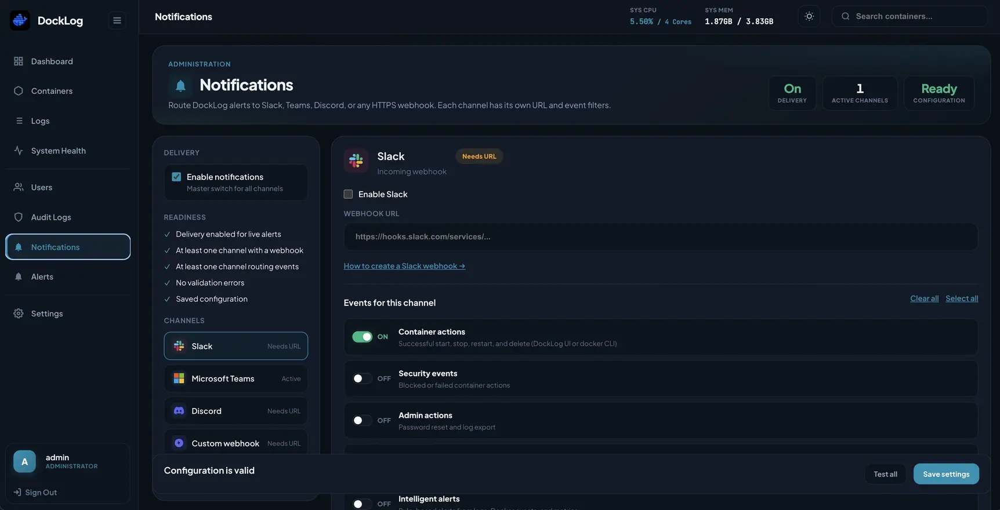
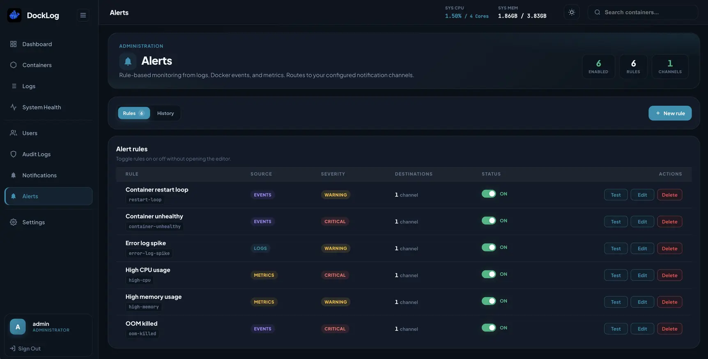
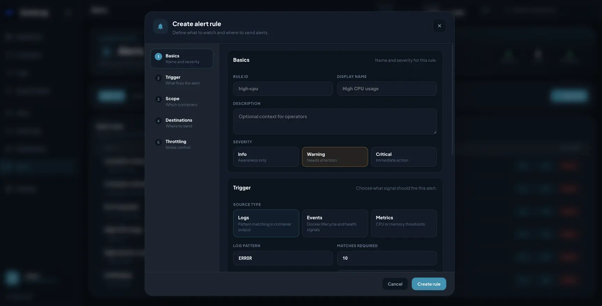

# DockLog 🐳

<p align="center">
  
</p>

<p align="center">
  <strong>High-performance, real-time Docker log viewer built for teams.</strong>
</p>

<p align="center">
  <a href="https://www.docklog.dev">Official Website</a> |
  <a href="https://www.docklog.dev/docs">Online Documentation</a>
</p>

<p align="center">
  Lightweight. Secure. Modern. Built for real-world Docker environments.
</p>

<p align="center">
  DockLog provides real-time log streaming, RBAC, audit logging, system monitoring, Docker container management, and optional Kubernetes visibility in a clean modern interface.
</p>

<p align="center">
  
  
  
  
  
  
</p>

---

> ⚡ Average setup time: under 2 minutes.

DockLog focuses on fast deployment, low resource usage, and team-safe Docker visibility without requiring heavyweight observability tooling.

---

# 📸 Preview

## 📊 Dashboard

<p align="center">
  
</p>

Real-time Docker monitoring with lightweight system metrics and container controls.

---

## 🐳 Container Management

<p align="center">
  
</p>

Monitor, control, and manage containers with fast operational actions.

---

## 📜 Real-Time Logs

<p align="center">
  
</p>

Stream container logs live with search, highlighting, and multi-container layout.

---

## 📈 System Health

<p align="center">
  
</p>

Historical CPU and memory charts with configurable time ranges.

---

## 🔐 RBAC & Staff Management

<p align="center">
  
</p>

Granular container-level permissions with wildcard and regex-based access control.

---

## 🕵️ Security Audit Logs

<p align="center">
  
</p>

Track administrative actions and security events with a complete audit trail.

---

## 🔔 Notifications

<p align="center">
  
</p>

Route events to Slack, Microsoft Teams, Discord, or a custom HTTPS webhook with per-channel filters.

---

## 🚨 Alert Rules

<p align="center">
  
</p>

Monitor containers with configurable rules for CPU, memory, restarts, and offline detection.

---

## ➕ Create Alert

<p align="center">
  
</p>

Define thresholds, severity, cooldowns, and notification channels for each alert rule.

---

# 🚀 Why DockLog?

Most Docker log viewers are built for a single administrator. DockLog is built for the entire team.

- **Team-First Security**: Wildcard and regex-based RBAC so developers only see the containers they need.
- **Audit Everything**: Full trail of who started, stopped, or changed containers.
- **Zero-Config Deployment**: No external database. Single container, embedded Vue UI, SQLite on disk.
- **Performance Without Compromise**: Go backend with a small memory footprint.
- **Modern UI**: Responsive dashboard with system/light/dark theme support.

---

# ✨ Features

## 📜 Real-Time Log Streaming

- WebSocket live streaming with JWT subprotocol auth (no tokens in URLs)
- Infinite scroll and manual history loading
- Log search, highlighting, and safe HTML rendering
- Auto-scroll with reconnect handling
- RFC3339Nano timestamp filtering

## 🔐 Advanced RBAC

- Wildcard permissions (`backend-*`) and full regex (`^prod-.*$`)
- Per-user start / stop / restart / delete rights
- Staff management and container-level isolation

## 🕵️ Audit & Security

- JWT authentication with session invalidation on password change
- First-login forced password reset
- Login rate limiting
- Client access control for the web UI (origin validation)
- Native API clients supported via standard JWT (no shared secrets in this repo)
- Full audit trail for sensitive actions

See [Security & RBAC](docs/SECURITY.md) for details.

## ☸️ Kubernetes (optional)

When `RUNTIME_MODE` is `kubernetes` or `both`:

- Namespace-scoped pod list, detail views, live logs, and shell access
- Workload hub for deployments, HPAs, services, and cluster events
- Namespace allowlist via `K8S_NAMESPACES`
- Graceful startup when the cluster is unreachable (UI shows connection status)

## 🎨 Modern UI

- Ocean/cyan design system with theme-aware logos
- **Auto / Light / Dark** theme (follows system by default)
- Mobile-friendly layout with responsive sidebar and search
- Lazy-loaded routes for faster initial load

## 📊 System Monitoring

- Host CPU and memory with live WebSocket stats
- Per-container metrics and historical charts
- Health dashboard with usage trends

## ⚡ High Performance

- ~30–50 MB RAM typical
- 10k+ log lines/sec throughput
- Embedded frontend in a single Go binary
- Optimized log rendering (capped DOM buffer)

---

# ⚙️ Configuration

## Environment Variables

| Variable             | Description                                                                                             | Default                       |
| -------------------- | ------------------------------------------------------------------------------------------------------- | ----------------------------- |
| `SECRET_KEY`         | JWT signing secret. **Required in production.**                                                         | `secret-key-change-this`      |
| `DB_PATH`            | SQLite database path                                                                                    | `docklog.db`                  |
| `PORT`               | HTTP listen port                                                                                        | `8000`                        |
| `DOCKER_HOST`        | Docker daemon socket                                                                                    | `unix:///var/run/docker.sock` |
| `RUNTIME_MODE`       | Runtime backend mode (`docker`, `kubernetes`, `both`). Controls which APIs and UI sections are enabled. | `docker`                      |
| `K8S_NAMESPACES`              | Comma-separated namespace allowlist. Empty = all namespaces allowed by cluster RBAC.                    | _(empty)_                     |
| `K8S_CONTEXT`                 | Kubernetes context override                                                                             | _(empty)_                     |
| `KUBECONFIG`                  | Path to kubeconfig                                                                                      | _(empty)_                     |
| `K8S_API_SERVER`              | Override Kubernetes API server URL from kubeconfig                                                      | _(empty)_                     |
| `K8S_REWRITE_LOCALHOST`       | Rewrite `127.0.0.1` / `localhost` in kubeconfig to `host.docker.internal` when running in Docker        | auto (`true` in Docker)       |
| `K8S_INSECURE_SKIP_TLS_VERIFY`| Skip TLS verification for the Kubernetes API (local/dev only)                                         | `false`                       |
| `DISABLE_AUTH`                | Disable auth (in-memory DB, no login). `NO_AUTH=true` is an alias.                                      | `false`                       |
| `CLIENT_ACCESS`      | Restrict `/api` and `/ws` to web UI + native clients (`strict` or `off`)                                | `strict`                      |
| `ALLOWED_ORIGINS`    | Extra browser origins for the Vue UI (comma-separated URLs)                                             | _(empty)_                     |
| `TRUST_PROXY`        | Honor `X-Forwarded-`\* headers when behind a reverse proxy                                              | `false`                       |
| `DEBUG_MODE`         | Enable verbose internal debug logs in container output                                                  | `false`                       |
| `ENV`                | Set to `production` to disable localhost origin bypass                                                  | _(empty)_                     |
| `ALLOW_START`        | Allow start action (no-auth mode env flags)                                                             | `false`                       |
| `ALLOW_STOP`         | Allow stop action                                                                                       | `false`                       |
| `ALLOW_RESTART`      | Allow restart action                                                                                    | `false`                       |
| `ALLOW_DELETE`       | Allow delete action                                                                                     | `false`                       |
| `ALLOW_SHELL`        | Allow interactive shell over WebSocket (`ALLOW_BASH` is an alias)                                       | `false`                       |
| `EXCLUDE_CONTAINERS` | Comma-separated container names to hide from the dashboard                                              | _(empty)_                     |

The DockLog container itself is **always hidden** (matched by name `docklog` or image containing `docklog`).

### Notifications (Slack, Teams, Discord, Custom webhooks)

Configure notifications from **Admin → Notifications** in the UI. Webhook URLs are stored in SQLite; there are no environment variables for notification delivery.

- **Master switch** turns delivery on or off for all channels.
- **Per channel** (Slack, Microsoft Teams, Discord, **Custom webhook**): webhook URL, enable/disable, and event filters.
- **Custom webhook** — POST JSON to any HTTPS endpoint (PagerDuty, n8n, Zapier, your own service). Set a display name and webhook URL in the UI.
- **Event types** (chosen per channel): container actions (start/stop/restart/delete), security events (blocked or failed actions), admin actions (password reset, log export), intelligent alerts, and DockLog version updates.
- **Email (SMTP)** is planned; the UI lists it as coming soon.

**Custom webhook JSON payloads** (`Content-Type: application/json`):

- **Audit / admin events** — `type: "audit"` with `title`, `user`, `action`, `resource`, `status`, `message`, `timestamp`, `source`
- **Alert rules** — `type: "alert"` with `title`, `ruleId`, `severity`, `container`, `host`, `source`, `message`, `recovery`, `timestamp`

Legacy env-based webhook URLs are migrated into `notification_channels` on first startup if present.

### Kubernetes (Docker Compose)

When `RUNTIME_MODE` is `kubernetes` or `both`, DockLog needs API access to a cluster. Without a kubeconfig, DockLog **starts anyway** and shows a warning; the Pods page reports the connection error.

**Option A — mount your local kubeconfig:**

```yaml
environment:
  - RUNTIME_MODE=both
  - KUBECONFIG=/app/kube/config
  - K8S_NAMESPACES=default,prod
volumes:
  - ${HOME}/.kube:/app/kube:ro
```

**Option B — run DockLog inside the cluster** with a ServiceAccount that can list pods/namespaces (in-cluster config is detected automatically).

**Docker Desktop / local clusters:** kubeconfig often points at `https://127.0.0.1:PORT`. Inside a container that address is unreachable, so DockLog rewrites it to `host.docker.internal` and sets TLS `ServerName=localhost` to match the Docker Desktop certificate. If you still see TLS errors after `docker compose up -d --build`, set `K8S_INSECURE_SKIP_TLS_VERIFY=true` in your environment.

### Production checklist

1. Generate and set a strong `SECRET_KEY`:

```bash
openssl rand -base64 32
```

2. Set `ENV=production` (or `GO_ENV=production`).
3. Keep `CLIENT_ACCESS=strict`.
4. Run behind Nginx, Traefik, or Caddy with HTTPS and set `TRUST_PROXY=true`.
5. Change the default `admin` / `admin123` password on first login.
6. Restrict network access to trusted users only (Docker socket access is high privilege).

### Client access

| Client                  | How it connects                                                           |
| ----------------------- | ------------------------------------------------------------------------- |
| **Vue web UI**          | Served by DockLog; sends `X-DockLog-Client: web` and passes origin checks |
| **Native mobile app**   | Standard JWT after `POST /api/token`; no extra headers published here     |
| **curl / random sites** | Blocked when `CLIENT_ACCESS=strict`                                       |

Set `CLIENT_ACCESS=off` only for local debugging.

### DockLog Mobile (companion app)

The official Flutter client supports **Advanced Settings** when adding a server:

- **Resolve Host to IP**: `/etc/hosts`-style override when the URL hostname is not in public DNS
- **Skip TLS verification**: self-signed certificates
- **Custom HTTP headers**: Cloudflare Access and similar proxies

---

# 👥 User Roles

## 👑 Administrator

Full container visibility, user management, audit log access, and container control.

## 🛠 Staff Member

Container/Pods visibility is controlled with patterns such as:

```text
redis
backend-*
prod-*, *-app
^prod-.*$
```

Users only see containers matching their assigned rules.

---

# 🚀 Getting Started

## 🔑 Default Login

| Username | Password   |
| -------- | ---------- |
| `admin`  | `admin123` |

> [!WARNING]
> Change the default administrator password immediately after first login.

---

## 🐳 Docker Compose (recommended)

```yaml
version: "3.8"

services:
  docklog:
    image: aimldev/docklog:latest
    container_name: docklog
    ports:
      - "8888:8000"
    environment:
      - SECRET_KEY=your-secure-key-here
      - DB_PATH=/app/data/docklog.db
      - CLIENT_ACCESS=strict
      - ENV=production
    volumes:
      - /var/run/docker.sock:/var/run/docker.sock
      - ./data:/app/data
    restart: unless-stopped
```

Or build locally from this repository:

```bash
docker compose up --build -d
```

Open **[http://localhost:8888](http://localhost:8888)**

### No-auth mode (development only)

```yaml
environment:
  - DISABLE_AUTH=true
```

---

## 🐳 Direct Docker Run

```bash
docker run -d \
  --name docklog \
  -p 8888:8000 \
  -v /var/run/docker.sock:/var/run/docker.sock \
  -v $(pwd)/data:/app/data \
  -e SECRET_KEY=your-secure-key-here \
  -e DB_PATH=/app/data/docklog.db \
  -e CLIENT_ACCESS=strict \
  --restart unless-stopped \
  aimldev/docklog:latest
```

---

## 🧑‍💻 Local Development

```bash
# Build frontend + backend
make build

# Install to PATH (optional)
make install          # -> /usr/local/bin/docklog
# or: go install .

# Run server (serves frontend/dist on :8000)
docklog
# same as: docklog server
```

### CLI commands

| Command                                | Description                                                     |
| -------------------------------------- | --------------------------------------------------------------- |
| `docklog`                              | Run full dashboard (default)                                    |
| `docklog server`                       | Full API + WebSockets + embedded Vue UI                         |
| `docklog agent`                        | Fleet agent mode (local UI + API; optional `CONTROL_PLANE_URL`) |
| `docklog agent-only`                   | Headless agent (API/WebSockets only, no bundled UI)             |
| `docklog reset-password <user> <pass>` | Reset a user password in SQLite                                 |
| `docklog config`                       | Print non-secret configuration                                  |
| `docklog version`                      | Print version                                                   |
| `docklog help [command]`               | Show help                                                       |

```bash
docklog help agent-only
docker exec docklog docklog reset-password admin 'NewSecurePass1'
```

Frontend dev server (separate terminal):

```bash
cd frontend && pnpm install && pnpm dev
```

Point the Vite dev proxy or API calls at `http://localhost:8000`. For unrestricted local API testing, set `CLIENT_ACCESS=off`.

---

# 🔒 Docker Socket Security

DockLog requires access to `/var/run/docker.sock`, which grants Docker API access to the application.

Recommended:

- Reverse proxy with TLS
- Firewall or VPN for admin access
- Strong passwords and rotated `SECRET_KEY`
- Keep `ALLOW_SHELL=false` unless explicitly needed

---

# 📚 Documentation

- [Official Website](https://www.docklog.dev)
- [Online Documentation & Guides](https://www.docklog.dev/docs)
- [Architecture Overview](docs/ARCHITECTURE.md)
- [Security & RBAC](docs/SECURITY.md)

---

# 📈 Performance

| Metric         | Value            |
| -------------- | ---------------- |
| RAM usage      | ~30–50 MB        |
| Log throughput | 10k+ lines/sec   |
| Deployment     | Single container |

---

# 🛣️ Roadmap

- Log retention controls
- Multi-host support
- External authentication providers

---

# 🤝 Contributing

1. Fork the repository
2. Create a feature branch
3. Submit a pull request

---

# 📦 Docker Hub

[https://hub.docker.com/r/aimldev/docklog](https://hub.docker.com/r/aimldev/docklog)

---

# 🔓 License

MIT License. See [LICENSE](LICENSE).

---

Built for developers who want real-time Docker visibility without deploying an observability cathedral.
