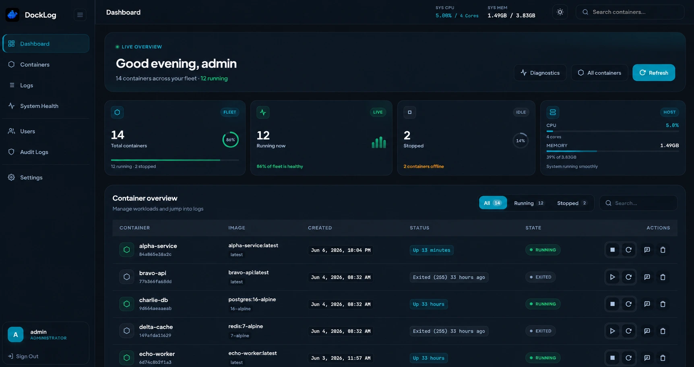
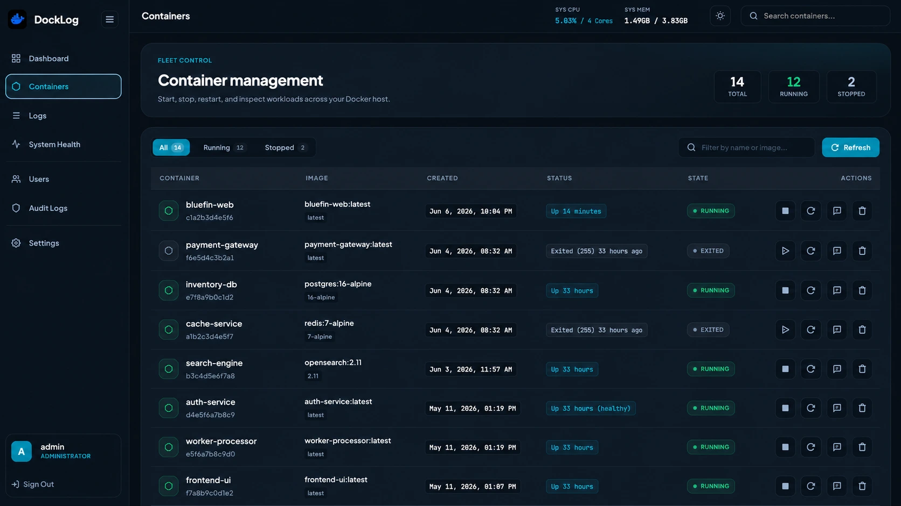
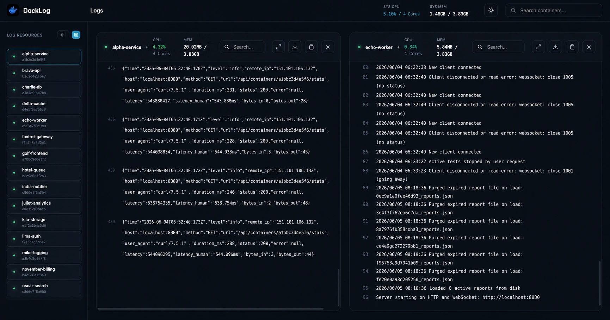
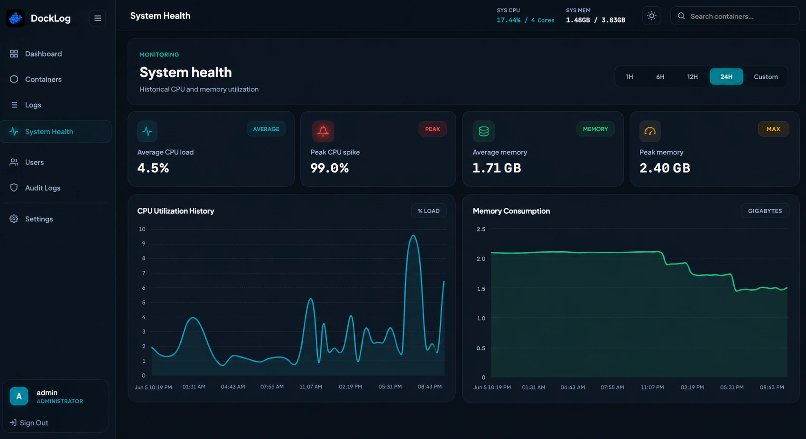
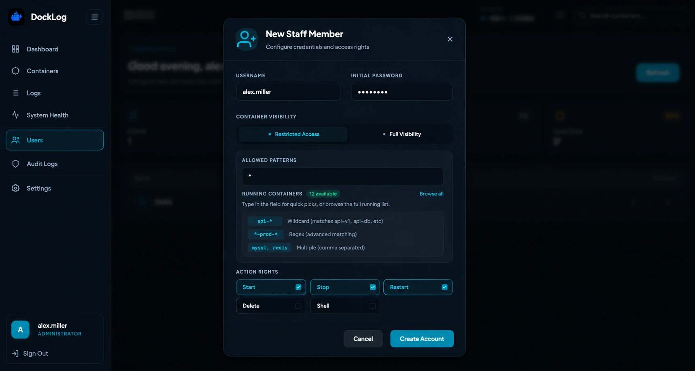
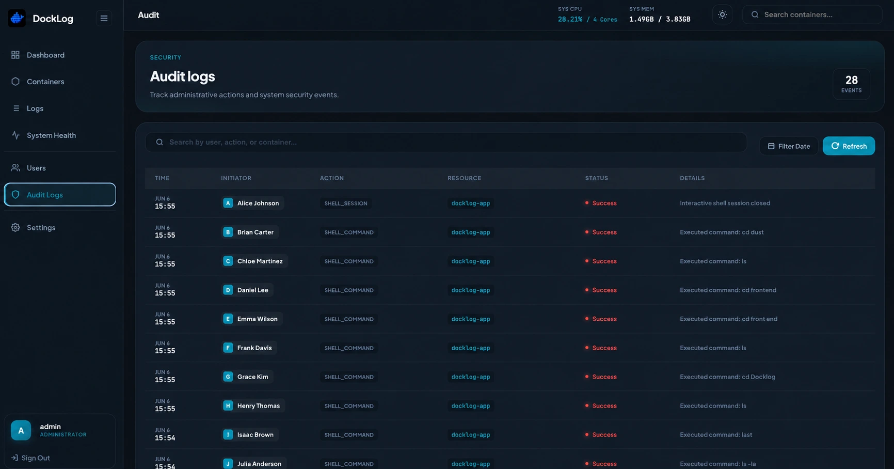

# DockLog 🐳

<p align="center">
  
</p>

<p align="center">
  <strong>High-performance, real-time Docker log viewer built for teams.</strong>
</p>

<p align="center">
  Lightweight. Secure. Modern. Built for real-world Docker environments.
</p>

<p align="center">
  DockLog provides real-time log streaming, RBAC, audit logging, system monitoring, and container management in a clean modern interface.
</p>

<p align="center">
  
  
  
  
  
  
</p>

---

> ⚡ Average setup time: under 2 minutes.

DockLog focuses on fast deployment, low resource usage, and team-safe Docker visibility without requiring heavyweight observability tooling.

---

# 📸 Preview

## 📊 Dashboard



Real-time Docker monitoring with lightweight system metrics and container controls.

---

## 🐳 Container Management



Monitor, control, and manage containers with fast operational actions.

---

## 📜 Real-Time Logs



Stream container logs live with search, highlighting, and multi-container layout.

---

## 📈 System Health



Historical CPU and memory charts with configurable time ranges.

---

## 🔐 RBAC & Staff Management



Granular container-level permissions with wildcard and regex-based access control.

---

## 🕵️ Security Audit Logs



Track administrative actions and security events with a complete audit trail.

---

# 🚀 Why DockLog?

Most Docker log viewers are built for a single administrator. DockLog is built for the entire team.

- **Team-First Security** — Wildcard and regex-based RBAC so developers only see the containers they need.
- **Audit Everything** — Full trail of who started, stopped, or changed containers.
- **Zero-Config Deployment** — No external database. Single container, embedded Vue UI, SQLite on disk.
- **Performance Without Compromise** — Go backend with a small memory footprint.
- **Modern UI** — Responsive dashboard with system/light/dark theme support.

---

# ✨ Features

## 📜 Real-Time Log Streaming

- WebSocket live streaming with JWT subprotocol auth (no tokens in URLs)
- Infinite scroll and manual history loading
- Log search, highlighting, and safe HTML rendering
- Auto-scroll with reconnect handling
- RFC3339Nano timestamp filtering

## 🔐 Advanced RBAC

- Wildcard permissions (`backend-*`) and full regex (`^prod-.*$`)
- Per-user start / stop / restart / delete rights
- Staff management and container-level isolation

## 🕵️ Audit & Security

- JWT authentication with session invalidation on password change
- First-login forced password reset
- Login rate limiting
- Client access control for the web UI (origin validation)
- Native API clients supported via standard JWT (no shared secrets in this repo)
- Full audit trail for sensitive actions

See [Security & RBAC](docs/SECURITY.md) for details.

## 🎨 Modern UI

- Ocean/cyan design system with theme-aware logos
- **Auto / Light / Dark** theme (follows system by default)
- Mobile-friendly layout with responsive sidebar and search
- Lazy-loaded routes for faster initial load

## 📊 System Monitoring

- Host CPU and memory with live WebSocket stats
- Per-container metrics and historical charts
- Health dashboard with usage trends

## ⚡ High Performance

- ~30–50 MB RAM typical
- 10k+ log lines/sec throughput
- Embedded frontend in a single Go binary
- Optimized log rendering (capped DOM buffer)

---

# 🛠 Tech Stack

| Layer            | Technology                |
| ---------------- | ------------------------- |
| Backend          | Go + Echo                 |
| Frontend         | Vue 3 + Vite              |
| Streaming        | WebSockets                |
| Database         | SQLite                    |
| Container Engine | Docker SDK                |
| Styling          | Vanilla CSS design system |

---

# ⚙️ Configuration

## Environment Variables

| Variable | Description | Default |
| -------- | ----------- | ------- |
| `SECRET_KEY` | JWT signing secret. **Required in production.** | `secret-key-change-this` |
| `DB_PATH` | SQLite database path | `docklog.db` |
| `PORT` | HTTP listen port | `8000` |
| `DOCKER_HOST` | Docker daemon socket | `unix:///var/run/docker.sock` |
| `DISABLE_AUTH` | Disable auth (in-memory DB, no login) | `false` |
| `CLIENT_ACCESS` | Restrict `/api` and `/ws` to web UI + native clients (`strict` or `off`) | `strict` |
| `ALLOWED_ORIGINS` | Extra browser origins for the Vue UI (comma-separated URLs) | _(empty)_ |
| `TRUST_PROXY` | Honor `X-Forwarded-*` headers when behind a reverse proxy | `false` |
| `ADMIN_PASSWORD` | Initial admin password (min 8 chars); random in production if unset | _(empty)_ |
| `ENV` | Set to `production` to disable localhost origin bypass | _(empty)_ |
| `ALLOW_START` | Allow start action (no-auth mode env flags) | `false` |
| `ALLOW_STOP` | Allow stop action | `false` |
| `ALLOW_RESTART` | Allow restart action | `false` |
| `ALLOW_DELETE` | Allow delete action | `false` |
| `ALLOW_SHELL` | Allow interactive shell over WebSocket | `false` |

### Production checklist

1. Generate and set a strong `SECRET_KEY`:
   ```bash
   openssl rand -base64 32
   ```
2. Set `ENV=production` (or `GO_ENV=production`).
3. Keep `CLIENT_ACCESS=strict`.
4. Run behind Nginx, Traefik, or Caddy with HTTPS and set `TRUST_PROXY=true`.
5. Note the random admin password from startup logs (or set `ADMIN_PASSWORD`) and change it on first login.
6. Restrict network access to trusted users only (Docker socket access is high privilege).

### Client access

| Client | How it connects |
| ------ | --------------- |
| **Vue web UI** | Served by DockLog; sends `X-DockLog-Client: web` and passes origin checks |
| **Native mobile app** | Standard JWT after `POST /api/token` — no extra headers published here |
| **curl / random sites** | Blocked when `CLIENT_ACCESS=strict` |

Set `CLIENT_ACCESS=off` only for local debugging.

---

# 👥 User Roles

## 👑 Administrator

Full container visibility, user management, audit log access, and container control.

## 🛠 Staff Member

Container visibility is controlled with patterns such as:

```text
redis
backend-*
prod-*, *-app
^prod-.*$
```

Users only see containers matching their assigned rules.

---

# 🚀 Getting Started

## 🔑 Default Login

| Username | Password |
| -------- | -------- |
| `admin`  | `admin123` |

> [!WARNING]
> Change the default administrator password immediately after first login.

---

## 🐳 Docker Compose (recommended)

```yaml
version: "3.8"

services:
  docklog:
    image: aimldev/docklog:latest
    container_name: docklog
    ports:
      - "8888:8000"
    environment:
      - SECRET_KEY=your-secure-key-here
      - DB_PATH=/app/data/docklog.db
      - CLIENT_ACCESS=strict
      - ENV=production
    volumes:
      - /var/run/docker.sock:/var/run/docker.sock
      - ./data:/app/data
    restart: unless-stopped
```

Or build locally from this repository:

```bash
docker compose up --build -d
```

Open **http://localhost:8888**

### No-auth mode (development only)

```yaml
environment:
  - DISABLE_AUTH=true
```

---

## 🐳 Direct Docker Run

```bash
docker run -d \
  --name docklog \
  -p 8888:8000 \
  -v /var/run/docker.sock:/var/run/docker.sock \
  -v $(pwd)/data:/app/data \
  -e SECRET_KEY=your-secure-key-here \
  -e DB_PATH=/app/data/docklog.db \
  -e CLIENT_ACCESS=strict \
  --restart unless-stopped \
  aimldev/docklog:latest
```

---

## 🧑‍💻 Local Development

```bash
# Build frontend + backend
make build

# Run server (serves frontend/dist on :8000)
./docklog
```

Frontend dev server (separate terminal):

```bash
cd frontend && pnpm install && pnpm dev
```

Point the Vite dev proxy or API calls at `http://localhost:8000`. For unrestricted local API testing, set `CLIENT_ACCESS=off`.

---

# 🔒 Docker Socket Security

DockLog requires access to `/var/run/docker.sock`, which grants Docker API access to the application.

Recommended:

- Reverse proxy with TLS
- Firewall or VPN for admin access
- Strong passwords and rotated `SECRET_KEY`
- Keep `ALLOW_SHELL=false` unless explicitly needed

---

# 📂 Project Structure

| Path | Description |
| ---- | ----------- |
| `main.go` | HTTP routes, Docker integration, WebSockets |
| `auth_helpers.go` | JWT validation, client access, rate limiting |
| `frontend/` | Vue 3 SPA (built into `frontend/dist`) |
| `db/` | SQLite schema and migrations |
| `docs/` | Architecture and security documentation |
| `.github/workflows/` | CI/CD |

---

# 📚 Documentation

- [Architecture Overview](docs/ARCHITECTURE.md)
- [Security & RBAC](docs/SECURITY.md)

---

# 📈 Performance

| Metric | Value |
| ------ | ----- |
| RAM usage | ~30–50 MB |
| Log throughput | 10k+ lines/sec |
| Deployment | Single container |

---

# 🛣️ Roadmap

- Log retention controls
- Notifications
- Multi-host support
- Kubernetes support
- External authentication providers

---

# 🤝 Contributing

1. Fork the repository
2. Create a feature branch
3. Submit a pull request

---

# 📦 Docker Hub

https://hub.docker.com/r/aimldev/docklog

---

# 🔓 License

MIT License — see [LICENSE](LICENSE).

---

<p align="center">
  Built for developers who want real-time Docker visibility without deploying an observability cathedral.
</p>
